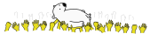

<main class="page">
  <section class="panel" data-layout="full">
    

      

        
        <h1 class="title">WeWantMoar</h1>
        <h2>Home of the events you love.</h2>
        
Coming soon. Underground events included*

        
*the ones you tell us to.

      

    

  </section>

[//]: # (--- Moar events section ---)



{.bear}



# Moar events!
    
## Simplistic discovery of events. For your unique taste.

We gather events from various of sources and put them into a same jar.
If we ever miss a thing, let us know and you'll be generously rewarded*

*with badges that costs us absolutely nothing.




[//]: # (--- Moar time section ---)




# Moar time.

## Set it and forget it. Your time is precious.

Create _event radars_ based on location and artist/genre. Create as many as you wish and get notified
when something happens*

*by _something_ we obviously mean events that match those radars.



{.bear}



[//]: # (--- Moar privacy section ---)



{.bear}



# Moar privacy.

The information you provide stays on your device. Things we need to know are anonymous and protected.
No accounts, no registration, no bull*

*we put the asterisk there to hide the word _shit_.




[//]: # (--- Embedded waitlist ---)

  <section class="panel" data-layout="full" id="waitlist">
    

      

        <h1>Join the pack. Get Moar.</h1>
        

          Sign up for the newsletter and be one of the chosen ones! There's only 500 spots in total!*
        

        

      

      

        
          *Don't miss out!
        
      

    

  </section>

[//]: # (--- Comics section ---)



{.bear}



# Still here?

While you're waiting, meet Mr. Crawley and [check here for some amazing comics](comics/2025_01.html)*

*After that you've seen everything we have to show right now.




<footer class="footer text-center w-900">
    

    
© 2025 WeWantMoar. All rights reserved.

    
Artwork © WeWantMoar or used with permission.

</footer>

</main>

<!-- MailerLite -->

<!-- Goat counter -->

